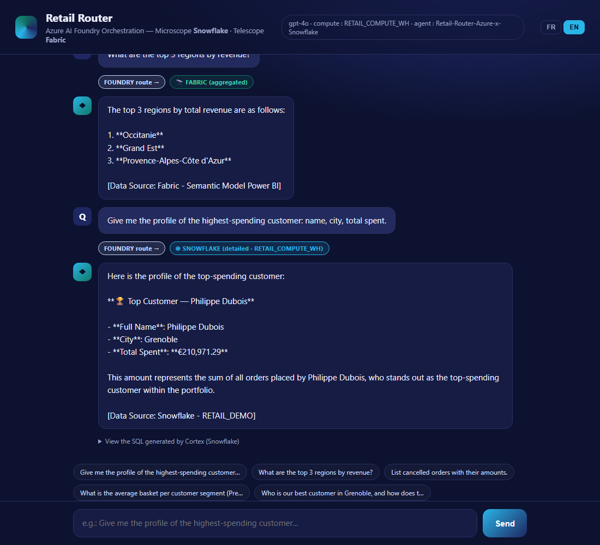

# Retail Router — Azure AI Foundry × Snowflake × Microsoft Fabric

A retail analytics demo built around an **orchestrator agent (the Router)** that
dispatches each question to the right **child agent**: detailed customer/order data
from **Snowflake** (Cortex), or aggregated strategic KPIs from **Microsoft Fabric**
(Power BI semantic model).



## How it works

Ask one question — the Router classifies it and calls a single specialist:

- *"Top 3 regions by revenue?"* → **Fabric** (aggregated KPIs) → answers from the Power BI semantic model.
- *"Profile of the highest-spending customer?"* → **Snowflake** (detail) → Philippe Dubois, Grenoble, €210,971.29.

One brain, two specialists, no data migration. Each answer cites its source, and the UI
tags which child responded.

## Architecture — Router + child agents

```
                          User
                           |
                           v
        +--------------------------------------------+
        |   RETAIL ROUTER  (Azure AI Foundry, gpt-4o)|
        |   Agent: Retail-Router-Azure-x-Snowflake   |
        |   Classifies the question, then routes:    |
        +------------------+-------------------------+
                           |
        AGGREGATED / KPI    \        / DETAILED / OPERATIONAL
                            v        v
   +-----------------------------+   +-------------------------------+
   |  CHILD AGENT — FABRIC       |   |  CHILD AGENT — SNOWFLAKE       |
   |  Fabric Data Agent          |   |  FOUNDRY_RETAIL_MCP_SERVER     |
   |  Power BI semantic model    |   |  Cortex Agent + SQL (MCP)      |
   |  Revenue, regions, segments,|   |  One customer, an order, an    |
   |  trends, margins, top N     |   |  individual record, history    |
   +-----------------------------+   +-------------------------------+
```

- **Router (parent):** Azure AI Foundry orchestrator. Picks exactly one child by
  default; uses both only when a question mixes detail + aggregation. Cites its source.
- **Fabric child:** aggregated, strategic questions (KPIs, regions, segments, trends).
- **Snowflake child:** detailed, operational questions (a named customer, an order, a
  list), answered by a Cortex Agent over `RETAIL_DEMO.PUBLIC` via a managed MCP server.

Full router/child details, IDs, auth and troubleshooting: **[foundry/README_FOUNDRY.md](foundry/README_FOUNDRY.md)**.

## Data model

6 tables of realistic synthetic data (France retailer):
`CUSTOMERS` (10K), `PRODUCTS` (2K), `CATEGORIES` (30), `STORES` (100),
`ORDERS` (50K), `ORDER_ITEMS` (325K+).

## Build the demo

1. **Generate data** — `cd data_generation && python generate_retail_data.py --size medium --format both`
2. **Snowflake** — run `snowflake/01_create_database.sql`, `02_create_tables.sql`, import CSVs, then `20_agent_intelligence.sql`, `21_foundry_integration.sql`
3. **Fabric** — load the aggregated semantic model (see `fabric/`, `fabric_app/`)
4. **Router (Foundry)** — `cd foundry && python create_router_agent.py` (Fabric only), then `python add_snowflake_mcp.py` to attach the Snowflake child (JWT via `SNOWFLAKE_JWT` env var)

## Optional — local Flask demo UI

A small bilingual (FR/EN) chat front-end is provided to exercise the router locally.

```powershell
cd foundry
.venv\Scripts\python.exe app.py   # http://localhost:5000
```

The web UI has an FR/EN toggle; the router replies in the chosen language and shows
which child agent answered (Snowflake vs Fabric) plus the generated SQL.

## Secrets

Tokens are read from environment variables and `.env` (git-ignored). **Never commit a
JWT or secret.** Set the Snowflake token before running scripts: `$env:SNOWFLAKE_JWT="..."`.

## Prerequisites

Python 3.10+, a Snowflake account with Cortex, Microsoft Fabric, Azure AI Foundry
(gpt-4o), `pip install -r requirements.txt`.
